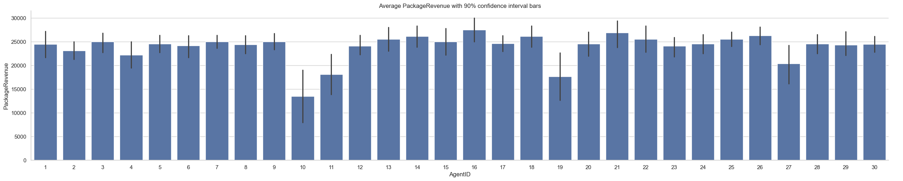
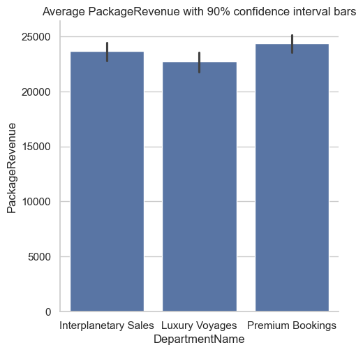
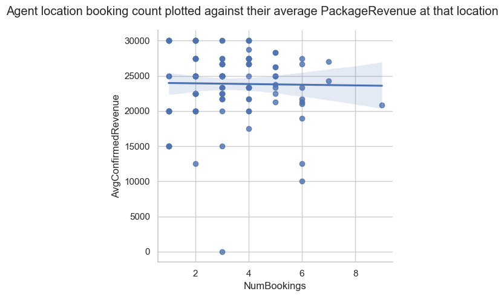

# space-challenge

**Table of Contents**
* [Analysis](#analysis)
    * [Stack ranking procedure](#stack-ranking-procedure)
    * [Algorithm Overview](#algorithm-overview)
    * [Things I ignore for my algorithm](#things-i-ignore-for-my-algorithm)
    * [Dataset analysis and observations](#dataset-analysis-and-observations)
    * [Recommendations](#recommendations)
* [Instructions](#instructions)

## Analysis

### Stack ranking procedure
The file `analysis/return_stack_ranked_agent_list.sql` defines a stored procedure, `ReturnStackRankedAgentList`, which returns a stack ranked list of `AgentID`s ordered by `AssignmentRank`.
The stored procedure takes 5 required parameters and 1 optional parameter. 
```sql
@CustomerName varchar(100)
@CommunicationMethod varchar(20)
@LeadSource varchar(20)
@Destination varchar(50)
@LaunchLocation varchar(100)
@ShowDetailedOutput bit = 0
```
The required parameters are the [details known at time of assignment](#known-details) and the optional parameter, `@ShowDetailedOutput`, returns an additional table with the columns used in calculating the stack ranking. 

### Algorithm Overview
I consider agents responsible for two variables: 
1. `PackageRevenue`
2. `BookingStatus`,  
While agents do not have complete control over these variables, more skilled agents should perform better on these metrics than less skilled agents. 

I capture both of these variables with the constructed variable:

>  `RealizedPackageRevenue` := `PackagedRevenue` if `BookingStatus='Confirmed'` otherwise `0`. 

Taking the average of an agents `RealizedPackageRevenue` gives a sense of how that agent's historical performance has impacted `TotalRevenue` and the bottom line. 
`RealizedPackageRevenue` may be higher for an agent with a high cancelation rate if the assignments that the agent does convert have high enough upsell packages.
Likewise, an agent who does not upsell as aggressively, but has a lower cancelation rate, may also have a higher `RealizedPackageRevenue`. 

I match incoming assignments to agents by ranking their `RealizedPackageRevenue` on previous assignments with the same combination of (in order of priority):

1. `Destination`
2. `LeadSource`
3. `CommunicationMethod`

If an incoming assignment has a combination of `Destination`, `LeadSource`, `CommunicationMethod` for which there is not at least 10 unique agents who have previously been assigned that exact combination, then I match instead on only `Destination` and `LeadSource`. 
If there are fewer than 10 agents in that set (Ganymede, for example), I match only on `Destination`.
Unrecognized destinations for which there is no history are assigned to the agent with the historically highest `RealizedPackageRevenue`. 

As a tie breaker, I then order agents by 
* The descending number of times they have previously appeard in that situation, `NumObs`
* Their `AverageCustomerServiceRating` descending
* Their most recent date and time they fielded an assignment with this situation, `LastAssignedDateTime`

### Things I ignore for my algorithm
* Pending bookings or agent assignments for which there is not a related booking. 
* `LaunchLocation` since it is highly correlated with `Destination`, without more context, I assume that agents are better suited to upsell destination features.
* `BookingRevenue` since, in this dataset, it is almost entirely determined by `Destination` and `LaunchLocation`. 
* `TotalRevenue` since it is simply the sum of `PackageRevenue` and `TotalRevenue`. 

### Dataset analysis and observations
It is difficult to draw statistically valid conclusions from this dataset since it is relatively small and contains a bredth of variables. 

Take, for example, this chart which shows  each agents' average `PackageRevenue` (including Pending bookings) with 90% confidence bars.



Although there is clearly variation between the agents' averages, few of them are statistically different from each other. 
Furthermore the few statistical relationships that are there almost certainly would not survive the necessary adjustment for [multiple hypothesis testing](https://en.wikipedia.org/wiki/Multiple_comparisons_problem). 

This same lack of statistical significance appears in all of the other relationship [which I tested](analysis/exploratory.ipynb).
There is no difference between agent's `PackageRevenue` by `DepartmentName`, `JobTitle`, `YearsOfService`, `AverageCustomerServiceRating`, `LeadSource`, or `CommunicationMethod`.  
No difference in department or job title `PackageRevenue` by `Destination`. 
No difference in cancelation rates across a host of database variables. 



I tested if agents with more bookings for a destination had higher revenue for that location by regressing an agent's average confirmed revenue (independent variable) against the number of times that agent has booked that location. 
Unfortunately, no statistical relation. 



Similar regressions of other variables also yielded no results. 

### Recommendations
I recommend Astra use the my algorithm for the next few quaters. 
At the current average rate of around 6 bookings per day we will have about 800 additional observations after six months which should be enough to find more robust statistical trends. 

## Instructions
**Algorithm Challenge**

The year is 2081, and you work for Astra Luxury Travel, a space adventure company that curates premium voyages across the Solar System. From exquisite getaways to the red deserts of Mars, to leisure cruises among Saturn’s rings, our team of Space Travel Agents ensures every customer enjoys the perfect experience—from initial Earth departure to safe return. Astra empowers humanity to explore the stars in style and comfort.

**Your Team: Enterprise Intelligence**

The Enterprise Intelligence Department at Astra Luxury Travel is the organization’s data-driven nerve center. Our mission is to harness advanced analytics, predictive modeling, and applied AI to maximize revenue for Astra.

**Project**

Your team must develop a real-time SQL assignment algorithm that automatically matches prospective customers with the best travel agent available. Agents not only guide customers through the booking process but also upsell luxury packages, exclusive excursions, and custom accommodations. At the end of each journey, customers rate their experience with their travel agent. Your solution should receive details about a customer (listed below) and return a stack-ranked list of travel agents ordered from best to worst. 

<span id="#known-details"></span>
Details known at time of assignment: 
- Customer Name
- Communication Method
- Lead Source
- Destination
- Launch Location

**Requirements**

- Provide a written overview of your model and the approach you chose
- Provide SQL Code that can be executed without errors
    - If your model requires the building of new tables, stored procedures or functions, make sure you provide the SQL code that creates them
